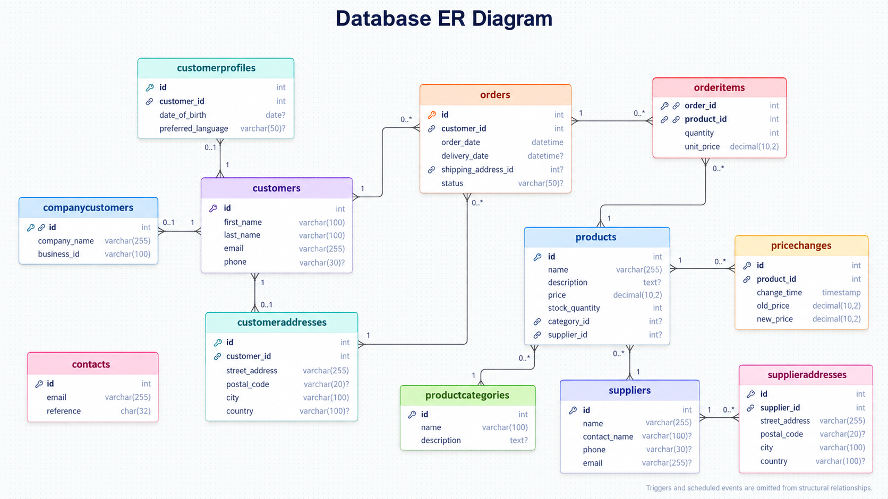

# Spring Boot Database Management System

A collaborative university project for the **Database Solutions** course. We developed a RESTful backend using **Spring Boot** and **MariaDB** to model and manage customers, orders, products, suppliers, and related business data.

The project focuses on relational database design, Java persistence with JPA/Hibernate, REST API development, and database-side functionality such as triggers and scheduled events.

## Technology Stack

| Technology | Purpose |
| --- | --- |
| Java 21 | Application development |
| Spring Boot 4.1.1 | REST backend |
| Spring Data JPA / Hibernate | Object-relational mapping and persistence |
| MariaDB | Relational database |
| Maven | Dependency management and build |
| Postman / DataGrip | API testing and database inspection |

## Project Overview

The database is designed around an order-management domain. Its core areas include:

- **Customer data:** Customer records, profiles, company customers, and addresses.
- **Orders:** Orders, delivery details, and individual order items.
- **Product catalog:** Products, product categories, and suppliers.
- **Inventory and pricing:** Product stock quantities and historical price-change records.
- **Database automation:** A trigger records product price changes, while a scheduled event removes old price-change history.

## Entity Relationship Diagram



The database schema contains **12 tables** with primary keys, foreign keys, and appropriate relationships. Customers can have multiple orders and addresses, while a customer profile is limited to one per customer. Orders and products have a many-to-many relationship represented by the `orderitems` junction table, whose composite primary key consists of `order_id` and `product_id`.

Products can belong to a category and have a supplier. Their price history is stored separately in `pricechanges`. The `contacts` table is independent in the supplied schema.

### Database Features

- **Referential integrity:** Foreign keys link related records across tables.
- **One-to-one and one-to-many relationships:** Including a unique customer-profile association and shared-key company-customer association.
- **Indexes:** An index on customer-address country and an index on price-change product IDs support relevant lookups.
- **Price-change trigger:** `products_after_update` records the previous and new prices whenever a product's price changes.
- **Scheduled cleanup:** `cleanup_old_pricechanges` runs every minute and removes price-change records older than 30 days when the MariaDB event scheduler is enabled.

## Running the Project

1. Install **Java 21** and **MariaDB**.
2. Create a MariaDB database and apply the project's database schema.
3. Set the application database URL, username, and password in your local Spring Boot configuration. The repository includes `.env.example` as a reference for the required connection values; ensure your local configuration actually loads them.
4. From the project root, run:

   ```bash
   ./mvnw spring-boot:run
   ```

   On Windows, use `mvnw.cmd spring-boot:run`.

5. Use an API client such as Postman to call the implemented REST endpoints. The default local Spring Boot URL is `http://localhost:8080` unless the port is configured differently.

**Security:** Do not commit actual database credentials or other secrets to GitHub.

## API Documentation

For endpoint descriptions, HTTP methods, request examples, responses, and testing details, see the separate document:

**[API Documentation](Documents/API_DOCUMENTATION.md)**

> The detailed API documentation is maintained separately to keep this README concise.

## Collaboration

This project was developed collaboratively as part of our coursework. The repository contains the shared implementation and database work.
